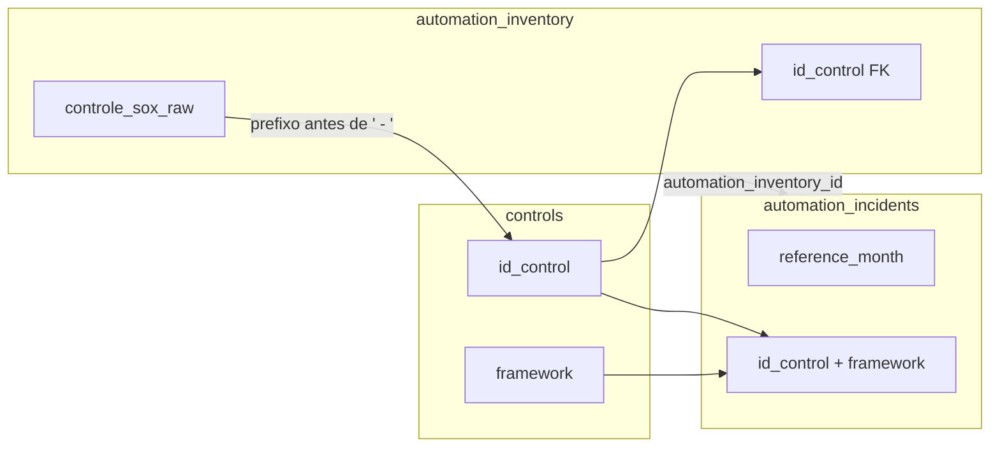

# KPI Compliance Tracker — Guia de sustentação

Documentação voltada a quem mantém o sistema: arquitetura, dados, convenções e pontos de atenção após evoluções recentes (inventário de automações, incidentes e integração com controles).

---

## 1. O que é este repositório

Aplicação **Next.js (App Router)** para acompanhamento de **controles**, **KPIs**, **planos de ação**, **inventário de automações SOX** e **incidentes** correlacionados a controles e frameworks. O banco de dados é **PostgreSQL** (ex.: Neon), acessado pela aplicação.

---

## 2. Stack e versões relevantes

| Área | Tecnologia |
|------|------------|
| Framework | Next.js 16, React 19 |
| Estilo | Tailwind CSS 4 |
| Autenticação | NextAuth.js 4 (Google SSO) |
| Banco | PostgreSQL via `DATABASE_URL` |
| Clientes SQL | Dois padrões coexistem (ver §5) |

Scripts úteis (na pasta `projeto/`):

- `npm run dev` — desenvolvimento  
- `npm run build` — build de produção  
- `npm run lint` — ESLint  

---

## 3. Estrutura de código (alto nível)

```
projeto/src/
├── app/
│   ├── (app)/              # Área autenticada da aplicação
│   │   ├── automacoes/     # Inventário + modal “Nova automação”
│   │   ├── incidentes/     # Lista e detalhe de incidentes
│   │   ├── controles/      # Cadastro, KPIs, execução
│   │   ├── kpis/           # KPIs e matrizes
│   │   ├── dashboard/      # Painéis
│   │   ├── planos/         # Planos de ação
│   │   └── admin/          # Configurações (ex.: upload Drive)
│   ├── login/
│   └── ...
├── lib/
│   ├── db.ts               # Cliente postgres.js (uso em automações/planos)
│   ├── automation-inventory.ts  # Helpers (ex.: parsing código SOX)
│   ├── google-drive.ts
│   └── auth-bypass.ts      # Bypass em localhost (não produção)
├── data/
│   ├── automacoes-inventario.ts   # Seed estático (só se BD vazio)
│   └── incidentes.ts            # Idem para incidentes
├── auth.ts                 # Opções NextAuth
└── ...
```

**Regra importante (Next.js 16):** arquivos com `"use server"` devem exportar **apenas** *server actions* assíncronas (`async function`) ou **tipos**. Funções utilitárias síncronas (ex.: parsing de strings) ficam em `lib/`, não em `actions.ts`, para evitar erro de build do Turbopack.

---

## 4. Banco de dados — modelo funcional

### 4.1 `controls`

Cadastro mestre de controles (importação CSV, telas de Controles/KPIs).

- Chave de negócio típica: `id_control` (ex.: `TEC_C92`).  
- Campos usados em correlações: `framework`, `name_control`, `reference_month` (entre outros).  
- **Atenção:** nem todas as instalações possuem colunas como `updated_at` / `created_at` em `controls`. Novas consultas devem usar apenas colunas existentes no seu ambiente (hoje o catálogo de automações ordena por `id_control` + `DISTINCT ON (id_control)`).

### 4.2 `automation_inventory`

Inventário de automações exibido em **Automações**.

| Conceito | Detalhe |
|----------|---------|
| PK | `inventory_id` (texto, ex.: `inv-001`) |
| Vínculo ao controle | `id_control` → `controls.id_control` (pode ser `NULL` se o prefixo do texto SOX não bater com nenhum controle) |
| Texto planilha | `controle_sox_raw` guarda o rótulo completo (“TEC_C92 - …”) |

**Seed:** se a tabela estiver **vazia**, na primeira leitura o sistema pode popular a partir de `src/data/automacoes-inventario.ts`. Se já houver linhas, **nada** é sobrescrito automaticamente.

**Código:** `src/app/(app)/automacoes/actions.ts` — `ensureAutomationInventorySchema`, `fetchAutomationInventoryList`, `createAutomationInventory`, `fetchControlsCatalogForAutomacao`, etc.

### 4.3 `automation_incidents`

Incidentes em **Incidentes**, ligados ao inventário e ao controle.

| Campo | Função |
|-------|--------|
| `automation_inventory_id` | Opcional; liga ao inventário |
| `id_control` / `framework` | Correlação explícita com controles/KPIs (framework pode ser preenchido na ingestão) |
| `reference_month` | Mês de competência (`YYYY-MM`) |
| JSON | `evidencias_json`, `historico_json` |

**Seed:** análogo ao inventário, a partir de `src/data/incidentes.ts` só quando a tabela está vazia.

**Código:** `src/app/(app)/incidentes/actions.ts`.

### 4.4 Fluxo de correlação (resumo)



---

## 5. Dois clientes PostgreSQL (atenção na sustentação)

Hoje coexistem:

1. **`@neondatabase/serverless` (`neon`)** — usado em várias *server actions* de `controles/`, `kpis/`, `admin/`, `controles/execucao/`, etc.  
2. **`postgres` (`postgres.js`)** — instanciado em `src/lib/db.ts`, usado em `automacoes/actions.ts`, `incidentes/actions.ts`, `planos/actions.ts`.

Ambos leem `process.env.DATABASE_URL`. Ao adicionar novas features, **mantenha o padrão da área** que você está editando (ou considere futura unificação em um único cliente, fora do escopo deste guia).

---

## 6. Variáveis de ambiente

Base em `.env.example` na raiz de `projeto/`:

| Variável | Uso |
|----------|-----|
| `DATABASE_URL` | Conexão PostgreSQL (SSL em `lib/db.ts`) |

**Google SSO** (`src/auth.ts`): `GOOGLE_CLIENT_ID`, `GOOGLE_CLIENT_SECRET` **ou** arquivo `client_secret_*.json` na raiz do projeto **ou** `GOOGLE_CLIENT_SECRET_FILE`. Em desenvolvimento local, credenciais podem ser omitidas se o bypass de localhost estiver ativo.

| Variável | Uso |
|----------|-----|
| `AUTH_SECRET` / `NEXTAUTH_SECRET` | Segredo NextAuth |
| `LOCALHOST_BYPASS_EMAIL` | Opcional; e-mail usado no bypass em `localhost` |

**Google Drive** (evidências): ver `README.md` principal e `src/lib/google-drive.ts`.

---

## 7. Rotas e origem dos dados (referência rápida)

| Rota | Origem principal | Actions / observação |
|------|------------------|----------------------|
| `/automacoes` | `automation_inventory` | `automacoes/actions.ts`; lista sempre do BD após possível seed |
| `/automacoes/[id]` | Idem + fallback estático se registro não existir no BD | `fetchAutomationInventoryById` |
| `/incidentes` | `automation_incidents` + join `automation_inventory` + `controls` | `incidentes/actions.ts` |
| `/controles`, `/controles/[id]` | `controls`, `control_kpis`, etc. | `controles/actions.ts`, `[id]/actions.ts` |
| `/kpis` | Mesmo ecossistema de controles/KPIs | `kpis/actions.ts` (inclui catálogo de controles sem `updated_at` em `controls`) |

---

## 8. UI — modal “Nova automação”

- **Framework:** filtra a lista de controles sugeridos.  
- **Controle cadastrado:** combobox (digitar para filtrar + lista + teclado). Ao escolher, o valor é copiado para o textarea **Controle SOX**.  
- Catálogo de controles: `fetchControlsCatalogForAutomacao` — não depende de `controls.updated_at`.

Arquivo principal: `src/app/(app)/automacoes/NovaAutomacaoModal.tsx`.

---

## 9. Resolução de `id_control` a partir do texto SOX

Função utilitária: `controlCodeFromControleSox` em `src/lib/automation-inventory.ts` — extrai o trecho antes do primeiro `" - "` (ex.: `TEC_C92` a partir de `TEC_C92 - Logical access…`). Esse código é comparado a `controls.id_control` para preencher `automation_inventory.id_control` na importação/criação.

---

## 10. Problemas comuns

| Sintoma | Verificar |
|---------|-----------|
| Build: “Server Actions must be async” | Não exportar função síncrona de arquivo `"use server"`; mover para `lib/`. |
| Erro SQL em catálogo de controles | Colunas inexistentes em `controls`; alinhar query a `information_schema` do ambiente. |
| Lista de automações vazia após deploy | `DATABASE_URL`, tabelas criadas, logs de `fetchAutomationInventoryList` / seed. |
| Incidentes sem framework | `controls.framework` na linha do `id_control`; revisar ingestão. |

---

## 11. Evolução recomendada (backlog técnico)

- Unificar cliente SQL (`neon` vs `postgres`) para reduzir surpresas.  
- Migrations versionadas (ex.: Drizzle/Knex/Flyway) em vez de apenas `CREATE TABLE IF NOT EXISTS` nas actions.  
- Remover ou isolar seeds estáticos quando o ambiente for estritamente produção.  
- Testes automatizados nas actions críticas de inventário/incidentes.

---

## 12. Onde pedir ajuda interna

Manter este arquivo atualizado quando:

- novas tabelas ou colunas forem adicionadas;  
- mudar a regra de seed ou de correlação controle/automação/incidente;  
- alterar variáveis de ambiente ou fluxo de autenticação.

Última orientação: após alterações em SQL compartilhado com o time, registre o **script** ou a **migration** no controle de versão junto com o código que a consome.
